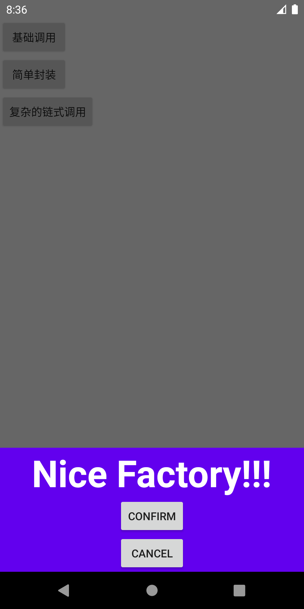

# NiceDialog   [简体中文](README_zh.md)
A Very Nice Dialog For Android Developer.

## Import

If you can easy connet to JCenter, you can use this to import `NiceDialog` into your project.

```gradle
implementation 'dog.abcd:nicedialog:1.0.0'
```

If not, you can also use this.

```gradle
repositories {
    maven { url 'https://jitpack.io' }
}
//something else...
implementation 'com.github.michaellee123:NiceDialog:1.0.0'
```

## Simple Usage

First at all, you should make your project support databinding, add this to your project's gradle.

 ```gradle
android {
    //something else...
    dataBinding {
        enabled = true
    }
}
 ```
 
 ## Create A Layout XML
 
 You just need make your all code included by `<layout></layout>`, like this.
 
 `dialog_nice.xml`
 
 ```xml
<layout>

    <LinearLayout xmlns:android="http://schemas.android.com/apk/res/android"
        android:layout_width="match_parent"
        android:layout_height="match_parent"
        android:background="@color/colorPrimary"
        android:gravity="center"
        android:orientation="vertical">

        <TextView
            android:id="@+id/tvMessage"
            android:layout_width="wrap_content"
            android:layout_height="wrap_content"
            android:textColor="#ffffff"
            android:textSize="48sp"
            android:textStyle="bold" />

        <Button
            android:id="@+id/btnConfirm"
            android:layout_width="wrap_content"
            android:layout_height="wrap_content" />

    </LinearLayout>
</layout>
 ```
 
 Then, databinding will auto create a class named `DialogNiceBinding`.
 
 ## Show A Dialog By NiceDialog
 
 Simply call `NiceDialog` at the desired location.
 
```kotlin
NiceDialog<DialogNiceBinding>(DialogNiceBinding.inflate(LayoutInflater.from(this)))
    .config {
        //You can configure some parameters, but not all
        width = WindowManager.LayoutParams.MATCH_PARENT //default is MATCH_PARENT
        height = WindowManager.LayoutParams.WRAP_CONTENT //default is MATCH_PARENT
        gravity = Gravity.BOTTOM //this is default value
        backgroundDrawable = ColorDrawable(0x00000000) //this is default value
        paddingTop = 0 //this is default value
        paddingBottom = 48 //default is 0
        paddingLeft = 48 //default is 0
        paddingRight = 48 //default is 0
        cancelable = true //this is default value
        animatorStyleRes = R.style.NiceDialog_Animation_SlideBottom //default is 0, 0 is mean not use animate
    }.bind { binding, dialog ->
        //You can bind value or listener for views
        binding.tvMessage.text = "Nice Dialog!"
        binding.btnConfirm.text = "Cool!"
        binding.btnConfirm.setOnClickListener { 
            //Close the dialog
            dialog.dismiss()
        }
    }.show(supportFragmentManager, "tag")//tag can be null, but I suggest be not null
```

You can get a dialog like this now.


You can also use `tag` to dismiss dialog.

```kotlin
NiceDialog.dismiss("tag")
```

## Code Encapsulation

In a project, a dialog is usually reused many times, so I made `NiceDialogFactory` for you. For example.

`dialog_circle.xml`

```xml
<layout>

    <RelativeLayout xmlns:android="http://schemas.android.com/apk/res/android"
        android:layout_width="match_parent"
        android:layout_height="match_parent">

        <ProgressBar
            android:id="@+id/progressBar"
            style="?android:attr/progressBarStyle"
            android:layout_width="wrap_content"
            android:layout_height="wrap_content"
            android:layout_centerInParent="true" />
    </RelativeLayout>
</layout>
```

Then we create a class based by `NiceDialogFactory`, like this.

```kotlin
class CircleDialogFactory(context: Context) :
    NiceDialogFactory<DialogCircleBinding, Unit, Unit>(
        DialogCircleBinding.inflate(LayoutInflater.from(context))
    ) {
    override fun config(): NiceDialogConfig.() -> Unit = {
        width = WindowManager.LayoutParams.WRAP_CONTENT
        height = WindowManager.LayoutParams.WRAP_CONTENT
        gravity = Gravity.CENTER
        cancelable = false
    }

    override fun binder(): (DialogCircleBinding, NiceDialogFragment<DialogCircleBinding>) -> Unit =
        { _, _ ->
        }

}
```

Simply call `CircleDialogFactory` at the desired location.

```kotlin
CircleDialogFactory(this).create().show(supportFragmentManager, "circle").onDismiss {
    //You can do something when dialog on dismiss.
    Toast.makeText(this, "on dismiss", Toast.LENGTH_LONG).show()
}
```

## Complex

You can also do something very complicated.

For example, you can do something in `NiceDialogFactory`, and you can also do something when you use `NiceDialogFactory`.

```kotlin
class TestDialogFactory(context: Context) :
    NiceDialogFactory<DialogNiceBinding, String, String>(
        DialogNiceBinding.inflate(LayoutInflater.from(context))
    ) {

    override fun config(): NiceDialogConfig.() -> Unit = {
        width = WindowManager.LayoutParams.MATCH_PARENT
        height = WindowManager.LayoutParams.WRAP_CONTENT
        gravity = Gravity.BOTTOM
    }

    override fun binder(): (DialogNiceBinding, NiceDialogFragment<DialogNiceBinding>) -> Unit =
        { binding, dialog ->
            binding.tvMessage.text = "Nice Factory!"
            binding.btnConfirm.text = "Confirm"
            binding.btnCancel.text = "Cancel"
            binding.btnConfirm.setOnClickListener {
                dialog.dismiss()
                next?.invoke("Next!")
            }
            binding.btnCancel.setOnClickListener {
                dialog.dismiss()
                finish?.invoke("Finish!")
            }
        }
}
```

Then, you can use `TestDialogFactory` like this.

```kotlin
TestDialogFactory(this)
    .onNext {
        Toast.makeText(this, it, Toast.LENGTH_LONG).show()
    }
    .onFinish {
        Toast.makeText(this, it, Toast.LENGTH_LONG).show()
    }
    .create()
    .config {
        animatorStyleRes = R.style.NiceDialog_Animation_Zoom
    }
    .bind { binding, _ ->
        binding.tvMessage.text = "${binding.tvMessage.text}!!"
    }
    .show(supportFragmentManager, "tag")
```

You can got a dialog like this.



## ImmersionBar

If it is a full-screen dialog and you need to operate the status bar, ImmersionBar is recommended

https://github.com/gyf-dev/ImmersionBar

In `bind{}` you can do something like this.

```kotlin
dialog.immersionBar {
    fitsSystemWindows(false)
    statusBarDarkFont(true)
}
```