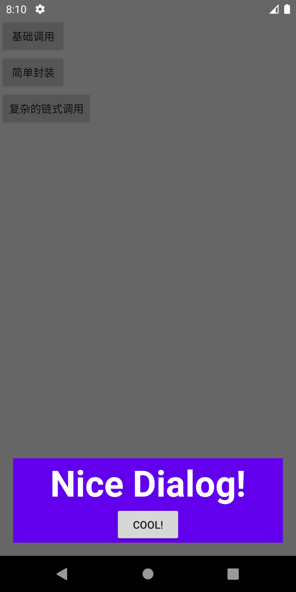

# NiceDialog   [简体中文](README_zh.md)
A Very Nice Dialog For Android Developer.

## Import

You can use this to import `NiceDialog` into your project.

```gradle
repositories {
    maven { url 'https://jitpack.io' }
}
//something else...
implementation 'com.github.michaellee123:NiceDialog:1.2.2'
```

## Simple Usage

First at all, you should make your project support viewBinding, add this to your project's gradle.

 ```gradle
android {
    //something else...
    viewBinding {
        enabled = true
    }
}
 ```
 
 ## Create A Layout XML
 
 `dialog_nice.xml`
 
 ```xml
<LinearLayout xmlns:android="http://schemas.android.com/apk/res/android"
    android:layout_width="match_parent"
    android:layout_height="match_parent"
    android:background="@color/colorPrimary"
    android:gravity="center"
    android:orientation="vertical">

    <TextView
        android:id="@+id/tvMessage"
        android:layout_width="wrap_content"
        android:layout_height="wrap_content"
        android:textColor="#ffffff"
        android:textSize="48sp"
        android:textStyle="bold" />

    <Button
        android:id="@+id/btnConfirm"
        android:layout_width="wrap_content"
        android:layout_height="wrap_content" />

</LinearLayout>
 ```
 
 Then, a class named `DialogNiceBinding` will auto created.
 
 If you use DataBinding, You need make your all code included by `<layout></layout>`.
 
 ## Show A Dialog By NiceDialog
 
 Simply call `NiceDialog` at the desired location.
 
```kotlin
NiceDialog(DialogNiceBinding::class.java)
    .config {
        //You can configure some parameters, but not all
        width = WindowManager.LayoutParams.MATCH_PARENT //default is MATCH_PARENT
        height = WindowManager.LayoutParams.WRAP_CONTENT //default is MATCH_PARENT
        gravity = Gravity.BOTTOM //this is default value
        backgroundColor = 0x00000000 //this is default value
        paddingTop = 0 //this is default value
        paddingBottom = 48 //default is 0
        paddingLeft = 48 //default is 0
        paddingRight = 48 //default is 0
        cancelable = true //this is default value
        animatorStyleRes = R.style.NiceDialog_Animation_SlideBottom //default is 0, 0 is mean not use animate
    }.bind {
        //You can bind value or listener for views
        binding.tvMessage.text = "Nice Dialog!"
        binding.btnConfirm.text = "Cool!"
        binding.btnConfirm.setOnClickListener { 
            //Close the dialog
            dismiss()
        }
    }.show(supportFragmentManager, "tag")//show a new dialog will dismiss old dialog that same tag, this tag must be the only one of the project.
```

You can get a dialog like this now.



You can also use `tag` to dismiss dialog.

```kotlin
NiceDialog.dismiss("tag")
```

## Code Encapsulation

In a project, a dialog is usually reused many times, so I made `NiceDialogFactory` for you. For example.

`dialog_circle.xml`

```xml
<RelativeLayout xmlns:android="http://schemas.android.com/apk/res/android"
    android:layout_width="match_parent"
    android:layout_height="match_parent">

    <ProgressBar
        android:id="@+id/progressBar"
        style="?android:attr/progressBarStyle"
        android:layout_width="wrap_content"
        android:layout_height="wrap_content"
        android:layout_centerInParent="true" />
</RelativeLayout>
```

Then we create a class based by `NiceDialogFactory`, like this.

```kotlin
class CircleDialogFactory(context: Context) :
    NiceDialogFactory<DialogCircleBinding, Unit, Unit>(context) {
    override fun config(): NiceDialogConfig.() -> Unit = {
        width = WindowManager.LayoutParams.WRAP_CONTENT
        height = WindowManager.LayoutParams.WRAP_CONTENT
        gravity = Gravity.CENTER
        cancelable = false
    }

    override fun binder(): NiceDialogFragment<DialogCircleBinding>.() -> Unit =
        {
        }

}
```

Simply call `CircleDialogFactory` at the desired location.

```kotlin
CircleDialogFactory(this).create().show(supportFragmentManager, "circle").onDismiss {
    //You can do something when dialog on dismiss.
    Toast.makeText(this, "on dismiss", Toast.LENGTH_LONG).show()
}
```

## Complex

You can also do something very complicated.

For example, you can do something in `NiceDialogFactory`, and you can also do something when you use `NiceDialogFactory`.

```kotlin
class TestDialogFactory(context: Context) :
    NiceDialogFactory<DialogNiceBinding, String, String>(context) {

    override fun config(): NiceDialogConfig.() -> Unit = {
        width = WindowManager.LayoutParams.MATCH_PARENT
        height = WindowManager.LayoutParams.WRAP_CONTENT
        gravity = Gravity.BOTTOM
    }

    override fun binder(): NiceDialogFragment<DialogNiceBinding>.() -> Unit =
        {
            binding.tvMessage.text = "Nice Factory!"
            binding.btnConfirm.text = "Confirm"
            binding.btnCancel.text = "Cancel"
            binding.btnConfirm.setOnClickListener {
                dismiss()
                next?.invoke("Next!")
            }
            binding.btnCancel.setOnClickListener {
                dismiss()
                finish?.invoke("Finish!")
            }
        }
}
```

Then, you can use `TestDialogFactory` like this.

```kotlin
TestDialogFactory(this)
    .onNext {
        Toast.makeText(this, it, Toast.LENGTH_LONG).show()
    }
    .onFinish {
        Toast.makeText(this, it, Toast.LENGTH_LONG).show()
    }
    .create()
    .config {
        animatorStyleRes = R.style.NiceDialog_Animation_Zoom
    }
    .bind {
        binding.tvMessage.text = "${binding.tvMessage.text}!!"
    }
    .show(supportFragmentManager, "tag")
```

You can got a dialog like this.


## Important changes ⚠️

I found something with android activity lifecycle, after device screen rotated, the callback with NiceDialog will be unworkable, 'cause the activity you can see is a new object, but callback will change the old one, so, I fix it.

Now you are ready know, when rebuilding the activity, we have to do something to change the callback to use the new one activity object.

 <del>With NiceDialog, you can do that easily. You only need to use `NiceDialog.create` or `NiceDialog.createFactory` to create the dialog in the onResume method, but you must ensure the tag is the only one of the project.</del>

 **In 1.2.0 version, you just need use the Activity or Context obj from callback.**

And you can see some code in the demo.

## ImmersionBar

If it is a full-screen dialog and you need to operate the status bar, ImmersionBar is recommended

https://github.com/gyf-dev/ImmersionBar

In `bind{}` you can do something like this.

```kotlin
immersionBar {
    fitsSystemWindows(false)
    statusBarDarkFont(true)
}
```

## Proguard

```
-keep class * implements androidx.viewbinding.ViewBinding{
    *;
}
```

## Use ViewBinding and DataBinding together

First of all, if your Android Studio is 4.2 version or higher, you should know , openJDK11 will install with Android Studio, it's not about your gradle setting, so if you use DataBinding broke by some exception, you should check the JDK version first. 'Cause DataBinding only work in JDK 1.8. PS: do not believe terminal 'java -version', only the project structure jdk location's version is right.
